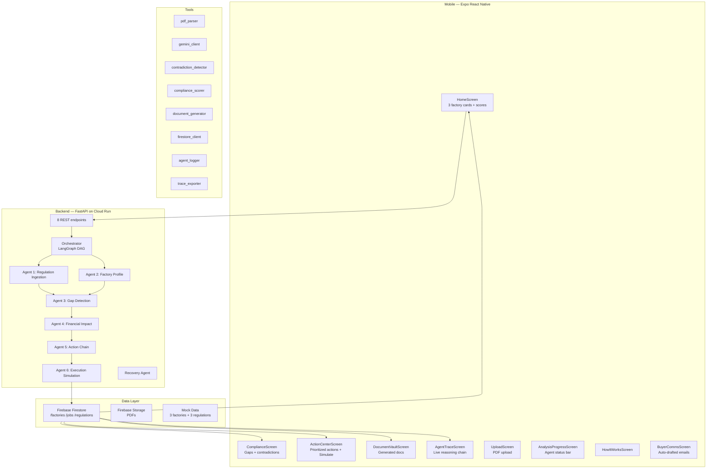

# ExportIQ — Full Implementation Plan

> **AISeekho 2026 Google Antigravity Hackathon** · Challenge 1: Autonomous Content-to-Action Agent  
> **Deadline:** May 20, 2026 · **Current Date:** May 18, 2026

---

## 1. Project Overview

ExportIQ is an agentic AI system that protects Pakistani textile factories from losing billions in EU/UK export orders by:

1. **Ingesting** EU/UK compliance regulation PDFs + factory audit reports
2. **Running 6 specialized AI agents** through a LangGraph DAG on Google Antigravity
3. **Detecting** compliance gaps and claim↔evidence contradictions
4. **Calculating** PKR financial risk per factory per buyer
5. **Generating** prioritized 3–5 action chains with deadlines
6. **Simulating** execution showing before/after compliance scores + document generation
7. **Streaming** everything to a mobile app in real time via Firestore

---

## 2. Tech Stack

| Layer | Technology | Rationale |
|---|---|---|
| **Mobile App** | Expo (React Native) | QR-scan demo via Expo Go, 9 screens built |
| **Backend** | Python 3.11 + FastAPI | Async-friendly, fast to build |
| **Agent Orchestration** | LangGraph StateGraph | Multi-agent DAG with parallel branches + recovery |
| **LLM** | Gemini 1.5 Pro (Vertex AI) | Required for Antigravity; PDF/doc understanding |
| **LLM Fallback** | Gemini via AI Studio API key | Backup if Vertex quota exhausted during demo |
| **Stub Mode** | Deterministic stubs | Pipeline runs end-to-end with zero credentials |
| **Database** | Firebase Firestore | Real-time listeners → mobile score animation |
| **File Storage** | Firebase Storage | Uploaded PDFs and generated documents |
| **Hosting** | Google Cloud Run | Serverless, free hackathon credits |
| **PDF Parsing** | PyMuPDF (fitz) + Gemini | Extract text from regulations + audit PDFs |
| **Auth** | Firebase Auth (anonymous) | Zero signup friction for demo |

---

## 3. System Architecture



### Agent Pipeline (DAG)

```
     START
      │
      ├──→ Regulation Ingestion ──┐
      │                            │  (parallel)
      └──→ Factory Profile ───────┘
                                   │
                                   ▼
                         Gap Detection
                                   │
                                   ▼
                        Financial Impact
                                   │
                                   ▼
                          Action Chain
                                   │
                                   ▼
                     Execution Simulation
                                   │
                                   ▼
                                  END

  Any agent failure → Recovery Agent → fallback artifact → pipeline continues
```

---

## 4. Component Inventory

### 4.1 Backend Files

| File | Purpose | Lines |
|---|---|---|
| `main.py` | FastAPI entry point, 8 routers mounted | 77 |
| `config.py` | Pydantic settings from `.env` | 46 |
| `agents/orchestrator.py` | LangGraph DAG + `run_pipeline()` + recovery wrapping | 247 |
| `agents/state.py` | `AgentState` TypedDict | 30 |
| `agents/base.py` | `log_step()` + `maybe_inject_failure()` helpers | 65 |
| `agents/regulation_agent.py` | Agent 1: Parse regulation PDFs → structured rulebook | 80 |
| `agents/factory_profile_agent.py` | Agent 2: Parse factory audit → canonical profile | 88 |
| `agents/gap_detection_agent.py` | Agent 3: Rule-based + LLM gap detection + contradictions | 339 |
| `agents/financial_impact_agent.py` | Agent 4: PKR risk calculation per buyer | 139 |
| `agents/action_chain_agent.py` | Agent 5: Generate 3–5 prioritized actions | 127 |
| `agents/execution_agent.py` | Agent 6: Simulate actions, animate score, generate docs | 210 |
| `agents/recovery_agent.py` | Failure fallback → remediation plan artifact | 54 |
| `tools/gemini_client.py` | Vertex AI → AI Studio → deterministic stub | 94 |
| `tools/firestore_client.py` | Real Firestore + in-memory `_MemStore` fallback | 200 |
| `tools/pdf_parser.py` | PyMuPDF text extraction + Gemini structure extraction | 80 |
| `tools/csv_processor.py` | Factory export data CSV ingestion | 40 |
| `tools/contradiction_detector.py` | Rule-based + LLM contradiction detection with grounding | 222 |
| `tools/compliance_scorer.py` | 0–100 compliance scoring from gaps + contradictions | 40 |
| `tools/document_generator.py` | Buyer emails, CBAM forms, audit checklists | 216 |
| `tools/agent_logger.py` | JSON log to disk + Firestore for agent traces | 130 |
| `tools/trace_exporter.py` | Antigravity-compatible markdown trace generator | 295 |
| `api/upload.py` | `POST /upload` — ingest PDFs/CSVs | 40 |
| `api/analyze.py` | `POST /analyze` — trigger full agent pipeline | 40 |
| `api/status.py` | `GET /status/{job_id}` — poll progress | 25 |
| `api/report.py` | `GET /report/{factory_id}` — final compliance report | 15 |
| `api/actions.py` | `GET /actions/{factory_id}` — get action chain | 20 |
| `api/simulate.py` | `POST /simulate/{factory_id}` — run execution simulation | 90 |
| `api/documents.py` | `GET /documents/{factory_id}` — list generated docs | 15 |
| `api/failure_test.py` | `POST /failure-test/{job_id}` — inject demo failure | 65 |

### 4.2 Mobile Files

| File | Purpose |
|---|---|
| `App.js` | Stack → Tab navigator, 6 routes + tab bar |
| `screens/HomeScreen.js` | 3 factory cards, circular score, risk badges, pull-to-refresh |
| `screens/ComplianceScreen.js` | Per-regulation gap breakdown, contradiction cards |
| `screens/ActionCenterScreen.js` | Action items with Simulate button |
| `screens/DocumentVaultScreen.js` | Generated documents viewer |
| `screens/BuyerCommsScreen.js` | Auto-drafted buyer emails |
| `screens/AgentTraceScreen.js` | Live agent reasoning trace |
| `screens/UploadScreen.js` | PDF file upload |
| `screens/AnalysisProgressScreen.js` | Agent status bar during analysis |
| `screens/HowItWorksScreen.js` | Explainer screen |
| `components/CircularScore.js` | Animated circular compliance score |
| `components/ComplianceScoreCard.js` | Score card widget |
| `components/ActionItem.js` | Single action card |
| `components/RiskBadge.js` | PKR risk amount badge |
| `components/AgentStatusBar.js` | Agent progress indicator |
| `components/ContradictionAlert.js` | Contradiction card |
| `components/EmptyState.js` | Empty state placeholder |
| `components/MarkdownStyles.js` | Markdown rendering styles |
| `services/api.js` | Fetch wrapper for 8 backend endpoints |
| `services/firebase.js` | Firestore real-time listeners |
| `services/format.js` | Number/date formatting utilities |
| `services/notifications.js` | Expo push notifications |
| `constants/colors.js` | Color palette + risk color mapping |
| `constants/config.js` | API URL, Firebase config, demo factories |

### 4.3 Antigravity Integration

| File | Purpose |
|---|---|
| `.agent/skills/regulation_parser/skill.md` | Skill: parse EU regulation PDFs |
| `.agent/skills/factory_profile/skill.md` | Skill: parse factory audit data |
| `.agent/skills/gap_detector/skill.md` | Skill: detect compliance gaps |
| `.agent/skills/financial_impact/skill.md` | Skill: calculate PKR risk |
| `.agent/skills/action_chain_generator/skill.md` | Skill: generate prioritized actions |
| `.agent/skills/execution_simulator/skill.md` | Skill: simulate action execution |
| `.agent/skills/contradiction_detector/skill.md` | Skill: find conflicting claims |
| `.agent/skills/document_drafter/skill.md` | Skill: generate buyer emails/reports |
| `.agent/workflows/full_compliance_analysis.md` | End-to-end analysis workflow |
| `.agent/workflows/daily_regulatory_scan.md` | Daily new regulation check workflow |

### 4.4 Mock Data

| File | Purpose |
|---|---|
| `mock_data/factories/fwi_fsd_001.json` + `.pdf` | Faisal Weave Industries (CRITICAL, score 43) |
| `mock_data/factories/cfw_lhe_002.json` + `.pdf` | Chenab Fabric Works (WARNING, score 78) |
| `mock_data/factories/rgl_khi_003.json` + `.pdf` | Ravi Garments Ltd (COMPLIANT, score 91) |
| `mock_data/regulations/eu_cbam.json` + `.pdf` | EU Carbon Border Adjustment Mechanism |
| `mock_data/regulations/uk_modern_slavery.json` + `.pdf` | UK Modern Slavery Act 2015 |
| `mock_data/regulations/eu_supply_chain_directive.json` + `.pdf` | EU CSDDD |

### 4.5 Documentation

| File | Purpose |
|---|---|
| `CLAUDE.md` | AI coding assistant instructions (524 lines) |
| `README.md` | Hackathon submission README |
| `docs/architecture.md` | System architecture for judges |
| `docs/demo_script.md` | Judge-facing 5-minute demo flow |
| `docs/agent_trace_example.md` | Example agent reasoning trace |

---

## 5. Data Flow (Per Analysis Run)

1. User taps **Run Full Analysis** on mobile
2. Mobile `POST /analyze` → `{ factory_id, regulation_ids[] }`
3. Backend creates `/jobs/{job_id}` → background task starts `run_pipeline()`
4. LangGraph graph invokes agents sequentially (Agents 1+2 in parallel):
   - Each agent reads from shared `AgentState`
   - Calls Gemini via `tools/gemini_client.py`
   - Writes outputs back to state
   - Appends reasoning steps to `/jobs/{job_id}.agent_trace[]`
   - Updates `/jobs/{job_id}.progress` and `current_agent`
5. Execution Simulation agent calls `update_compliance_score()` after each simulated action → drives mobile score animation
6. Final report saved to `/factories/{id}/reports/latest`
7. Mobile Firestore listeners update all screens in real time

### Real-Time Mechanics

| Firestore Document | Updated By | Subscribed By |
|---|---|---|
| `/factories/{id}` (score, risk) | Execution agent (per action) | HomeScreen, ComplianceScreen |
| `/jobs/{id}` (progress, trace) | Every agent (per step) | AgentTraceScreen, AgentStatusBar |
| `/factories/{id}/reports/latest` | Orchestrator (end of pipeline) | ComplianceScreen, ActionCenter, DocVault, BuyerComms |

---

## 6. API Endpoints

| Method | Path | Purpose |
|---|---|---|
| `POST` | `/upload` | Ingest PDFs/CSVs (multipart) |
| `POST` | `/analyze` | Trigger full 6-agent pipeline |
| `GET` | `/status/{job_id}` | Poll progress + current agent |
| `GET` | `/report/{factory_id}` | Full compliance report |
| `GET` | `/actions/{factory_id}` | Action chain items |
| `POST` | `/simulate/{factory_id}` | Run execution simulation for selected actions |
| `GET` | `/documents/{factory_id}` | List generated documents |
| `POST` | `/failure-test/{job_id}` | Inject controlled failure for demo |

---

## 7. Hackathon Evaluation Criteria Mapping

| Criterion | Weight | How ExportIQ Covers It |
|---|---|---|
| **Google Antigravity Integration** | 25% | 8 skills in `.agent/skills/`, 2 workflows, all agents visible in Manager view, artifacts produced by every agent |
| **Agentic Reasoning & Workflow** | 20% | Multi-step LangGraph DAG, parallel branches, contradiction detection, constraint-based prioritization, failure recovery with fallback artifacts |
| **Insight & Decision Quality** | 20% | Specific PKR figures, named regulations/buyers, contradiction evidence citing source filenames, deterministic + LLM gap detection |
| **Action Simulation & Outcome** | 15% | Score delta animation, PKR risk reduction, CBAM forms/buyer emails/checklists generated, before/after state visible |
| **Technical Implementation** | 10% | FastAPI + LangGraph + Firebase + Expo, clean agents/tools/models separation, 3-tier Gemini fallback, recovery wiring |
| **Innovation & UX** | 10% | No existing solution for Pakistan textile compliance, mobile-first, financial stakes in PKR, real-time animations |

---

## 8. Key Design Decisions

1. **3-Tier Gemini Fallback**: Vertex AI → AI Studio API key → deterministic stubs. Pipeline never breaks regardless of credentials.
2. **Rule-Based + LLM Hybrid**: Contradiction detection and gap detection both have hard-coded rules that guarantee demo output, plus LLM passes for subtler catches.
3. **Grounded Contradictions**: LLM-generated contradictions are filtered — only accepted if `source_a` and `source_b` match actual input filenames. Prevents hallucinated sources.
4. **Real-Time Score Animation**: Execution agent calls `update_compliance_score()` after each simulated action with a 400ms delay, driving a visible score climb on the mobile dashboard.
5. **Recovery Agent Pattern**: Every agent is wrapped with `_wrap_with_recovery()`. Failure → recovery agent artifact → `_fallback_for()` minimal output → pipeline continues.
6. **Proactive Buyer Emails**: Buyer emails are phrased as "quarterly compliance status updates" — never confessional. Strict naming rules block real audit firm names.

---

*Generated May 18, 2026 — AISeekho 2026 Google Antigravity Hackathon*
