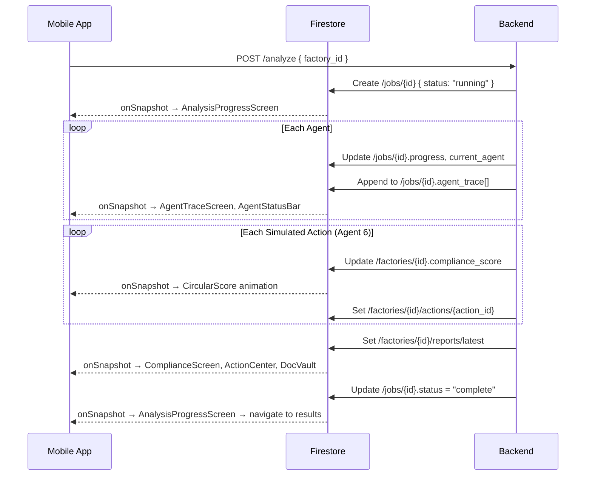
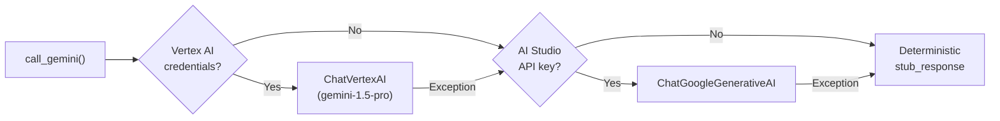

# ExportIQ — Architecture Walkthrough

> **AISeekho 2026 Google Antigravity Hackathon** · Challenge 1  
> A judge-facing technical walkthrough of the system architecture

---

## 1. System Overview

ExportIQ is a **stateful multi-agent compliance system** that processes EU/UK regulatory documents and Pakistani factory audit reports through 6 specialized AI agents, orchestrated as a LangGraph directed acyclic graph (DAG) running on Google Antigravity.

```
┌────────────────────────────────────────────────────────────────┐
│                    MOBILE APP (Expo React Native)              │
│                                                                │
│  Splash → Home → Factory tabs (Compliance · ActionCenter · DocVault) │
│  Upload · AnalysisProgress · HowItWorks · EditEmail · Settings · Deadlines │
│  AgentTrace (hidden dev route — 5-tap easter egg on the brand text)        │
│                                                                │
│          ▲ Firestore onSnapshot()        ▲ REST POST/GET       │
└──────────┼───────────────────────────────┼─────────────────────┘
           │                               │
           │  Real-time listeners          │  HTTP
           │                               │
┌──────────┼───────────────────────────────┼─────────────────────┐
│          │       FIREBASE FIRESTORE      │                     │
│          │                               │                     │
│  /factories/{id}          /jobs/{id}     │                     │
│  /factories/{id}/reports  /regulations   │                     │
│  /factories/{id}/actions                 │                     │
└──────────┬───────────────────────────────┼─────────────────────┘
           │                               │
           │  Writes during pipeline       │
           │                               │
┌──────────┴───────────────────────────────┴─────────────────────┐
│                FASTAPI BACKEND (Cloud Run)                      │
│                                                                │
│  main.py ──┬── /upload    ──── pdf_parser + Storage            │
│            ├── /analyze   ──── run_pipeline() background task  │
│            ├── /status    ──── poll job progress                │
│            ├── /report    ──── compliance report                │
│            ├── /simulate  ──── re-run execution simulation      │
│            ├── /actions   ──── action chain items               │
│            ├── /documents ──── generated artifacts              │
│            └── /failure-test ─ demo failure injection           │
│                                                                │
│  ┌──────────────────────────────────────────────────────────┐  │
│  │              LANGGRAPH DAG (orchestrator.py)              │  │
│  │                                                          │  │
│  │   START ──┬── [Regulation Ingestion]──┐                  │  │
│  │           │                           ├─ [Gap Detection] │  │
│  │           └── [Factory Profile] ──────┘        │         │  │
│  │                                     [Financial Impact]   │  │
│  │                                          │               │  │
│  │                                   [Action Chain]         │  │
│  │                                          │               │  │
│  │                              [Execution Simulation]      │  │
│  │                                          │               │  │
│  │                                        END               │  │
│  │                                                          │  │
│  │   Any failure → [Recovery Agent] → fallback → continue   │  │
│  └──────────────────────────────────────────────────────────┘  │
│                                                                │
│  tools/ ── gemini_client · firestore_client · pdf_parser       │
│            contradiction_detector · compliance_scorer           │
│            document_generator · agent_logger · trace_exporter   │
│                                                                │
│  models/ ── Factory · Regulation · GapReport · ActionChain     │
└────────────────────────────────────────────────────────────────┘
```

---

## 2. Agent State Management

All 6 agents share a single `AgentState` TypedDict that flows through the LangGraph DAG. Each agent reads its inputs from the state and returns a dict of patches that get merged back:

```python
class AgentState(TypedDict, total=False):
    # Inputs
    job_id: str
    factory_id: str
    regulation_ids: list[str]

    # Agent 1 output
    regulation_rules: list[dict]          # Structured rulebook

    # Agent 2 output
    factory_data: dict                    # Canonical factory profile

    # Agent 3 output
    gaps: list[dict]                      # Compliance gaps
    contradictions: list[dict]            # Claim ↔ evidence conflicts

    # Agent 4 output
    financial_impact: dict                # PKR risk per buyer

    # Agent 5 output
    action_chain: list[dict]             # 3-5 prioritized actions

    # Agent 6 output
    simulation_result: dict              # Before/after scores + docs
    documents: list[dict]                # Generated artifacts

    # Cross-cutting
    agent_trace: list[dict]              # Accumulated reasoning steps
    errors: list[dict]                   # Error records
    recovery_used: bool                  # Whether recovery agent activated
    inject_failure_in: str | None        # Demo failure injection target
    inject_failure_type: str | None      # Demo failure type
```

> [!IMPORTANT]
> The `agent_trace` key uses LangGraph's `operator.add` reducer — every agent's trace entries are **accumulated**, not overwritten. This is how the mobile AgentTraceScreen shows the full reasoning chain.

---

## 3. Agent Pipeline — Detailed Flow

### 3.1 Parallel Start

Agents 1 (Regulation Ingestion) and 2 (Factory Profile) run **in parallel** from the `START` node. Both must complete before Gap Detection begins.

```python
# orchestrator.py — build_graph()
g.add_edge(START, "regulation_ingestion")
g.add_edge(START, "factory_profile")
g.add_edge("regulation_ingestion", "gap_detection")
g.add_edge("factory_profile", "gap_detection")
```

### 3.2 Agent 1: Regulation Ingestion

**Input:** `regulation_ids[]` (e.g. `["eu_cbam", "uk_modern_slavery", "eu_supply_chain_directive"]`)  
**Output:** `regulation_rules[]` — structured rulebook with deadlines, limits, Pakistan-applicability flags

```
Priority: Pre-parsed JSON > PDF + Gemini extraction > Empty rulebook
Path: mock_data/regulations/{reg_id}.json → .pdf → []
```

Each rule has: `rule_id`, `regulation_name`, `requirement`, `category` (AUDIT_CERTIFICATION, CHEMICAL, REPORTING, CARBON, LABOUR), `severity_if_missed`, `deadline`, `numerical_limit`, `certification`.

### 3.3 Agent 2: Factory Profile

**Input:** `factory_id` (e.g. `fwi_fsd_001`)  
**Output:** `factory_data` — canonical profile with claims, audit evidence, certifications, export volumes

```
Priority: Pre-parsed JSON > PDF + Gemini extraction > Empty profile
Path: mock_data/factories/{factory_id}.json → .pdf → minimal
```

Profile structure:
- `factory_name`, `city`, `annual_export_pkr`
- `claims[]` — self-reported statements (e.g. "ISO 14001 compliant")
- `audit_evidence[]` — measured values with metric, value, unit, source
- `certifications[]` — name, status (VALID/EXPIRED), expiry_date
- `primary_buyers[]`, `exports_by_buyer_pkr{}`

### 3.4 Agent 3: Gap Detection

**Input:** `regulation_rules[]` + `factory_data`  
**Output:** `gaps[]` + `contradictions[]`

Two-pass architecture:

```
┌─────────────────────────────┐
│  Deterministic Pass         │ — Rule-based checks:
│  • Cert exists + not expired│   AUDIT_CERTIFICATION: cert lookup
│  • Numerical limits         │   CHEMICAL: value > limit
│  • Reporting claims         │   REPORTING/CARBON: claim exists
│  • Labour metrics           │   LABOUR: value > limit
└─────────┬───────────────────┘
          │
┌─────────┴───────────────────┐
│  LLM Pass                   │ — Gemini catches subtle gaps
│  • Prompt with rules +      │   the deterministic pass misses
│    factory profile           │
│  • Returns JSON gaps         │
└─────────┬───────────────────┘
          │
┌─────────┴───────────────────┐
│  Merge + Dedup              │ — Key: regulation|requirement[:60]
└─────────┬───────────────────┘
          │
┌─────────┴───────────────────┐
│  Contradiction Detection    │ — Rule-based + LLM + grounding:
│  • ISO 14001 vs water audit │   • ISO 14001 claim + discharge > limit → conflict
│  • SA8000 vs working hours  │   • SA8000 claim + hours > 60 → conflict
│  • LLM catches subtle ones  │   • Filter: source_a ∈ claims, source_b ∈ evidence
└─────────┬───────────────────┘
          │
┌─────────┴───────────────────┐
│  Display Title Generation   │ — Heuristic (regex) + Gemini refinement
│  • ≤6 words, imperative     │   "File EU Carbon Tax Report"
│  • No raw acronyms          │   "Renew Social Accountability Certificate"
└─────────────────────────────┘
```

> [!NOTE]
> The grounding filter is critical: any LLM contradiction where `source_a` doesn't appear in the actual claim sources or `source_b` doesn't appear in the actual evidence sources is **dropped**. This prevents Gemini from hallucinating filenames like "payroll_spot_check.xlsx" that don't exist.

### 3.5 Agent 4: Financial Impact

**Input:** `gaps[]` + `factory_data`  
**Output:** `financial_impact` — PKR risk calculation

```
Severity → Risk %: CRITICAL=80%, HIGH=50%, MEDIUM=20%, LOW=5%
Per buyer: jurisdiction (EU/UK) → worst gap severity for that jurisdiction → % of buyer's orders at risk
Buyer concentration: top buyer's share of total exports
```

### 3.6 Agent 5: Action Chain

**Input:** `gaps[]` + `financial_impact`  
**Output:** `action_chain[]` — 3-5 prioritized actions

```
Ranking: gaps sorted by (-severity_penalty, days_remaining)
Top 5 selected. Each action:
  - PKR impact = orders_at_risk * (severity_weight / total_weight)
  - Effort mapped from gap status: MISSING=HIGH, EXPIRED=MEDIUM, etc.
  - Deadline copied from gap or default 60 days from today
```

### 3.7 Agent 6: Execution Simulation

**Input:** `gaps[]` + `action_chain[]` + `financial_impact` + `factory_data`  
**Output:** `simulation_result` + `documents[]` + updated `action_chain[]`

```
For each action (in priority order):
  1. Mark gap_ids as resolved
  2. Recalculate compliance score from remaining gaps
  3. Compute new risk = max(0, current_risk - action.impact_pkr)
  4. Generate supporting documents (CBAM form, audit checklist)
  5. update_compliance_score() → Firestore → mobile animation
  6. sleep(0.4s) → let animation breathe
  7. Persist action to /factories/{id}/actions/{action_id}

Buyer emails: generated ONCE per buyer up-front (not per action)
  - Proactive quarterly compliance status update tone
  - Never confessional — frames work as "routine refresh cycle"
```

---

## 4. Real-Time Data Flow

Three Firestore document paths drive every live update during the demo:



---

## 5. Failure Recovery Architecture

Every agent is wrapped with `_wrap_with_recovery()`:

```python
def _wrap_with_recovery(agent_name, fn):
    def node(state):
        try:
            return fn(state)                    # Normal execution
        except Exception as exc:
            # 1. Log traceback to agent_trace
            append_trace(job_id, {"agent": agent_name, "step": "exception", ...})

            # 2. Recovery agent produces fallback artifact
            recovery_patch = recovery_agent.run(state)

            # 3. Best-effort minimal output for THIS agent
            fallback_patch = _fallback_for(agent_name, state)

            # 4. Merge and continue — pipeline does NOT stop
            return {**recovery_patch, **fallback_patch}
    return node
```

### Fallback outputs per agent

| Agent | Fallback Output |
|---|---|
| Regulation Ingestion | `regulation_rules: []` |
| Factory Profile | Minimal profile with factory_id + city |
| Gap Detection | `gaps: [], contradictions: []` |
| Financial Impact | Zero PKR exposure |
| Action Chain | `action_chain: []` |
| Execution Simulation | Zero score delta, no documents |

### Demo failure injection

```bash
curl -X POST https://backend/failure-test/$JOB_ID \
  -H "Content-Type: application/json" \
  -d '{"agent": "execution_simulation", "failure_type": "api_timeout"}'
```

This sets `inject_failure_in` and `inject_failure_type` on the pipeline state. The target agent checks `maybe_inject_failure()` and raises a controlled exception. Judges see:

1. Agent ERROR in Antigravity Manager view
2. Recovery agent activates → produces `REMEDIATION_PLAN` artifact
3. Pipeline continues → mobile updates resume

---

## 6. Gemini Integration — 3-Tier Fallback



Every `call_gemini()` call includes a `stub_response` parameter — the exact output the pipeline should produce when no LLM is available. This guarantees:

- **Zero-credential local dev**: Pipeline runs end-to-end, produces demo-quality output
- **Quota exhaustion resilience**: Switch to AI Studio key mid-demo
- **Deterministic demo output**: Stub responses are carefully crafted to match expected format

---

## 7. Mobile App Architecture

```
App.js
├── Stack.Navigator
│   ├── HomeScreen (headerless)
│   │   └── 3-4 FactoryCard components with CircularScore
│   ├── Factory → Tab.Navigator
│   │   ├── Tab: Status → ComplianceScreen
│   │   ├── Tab: Fix It → ActionCenterScreen
│   │   └── Tab: Documents → DocumentVaultScreen
│   ├── DevTrace → AgentTraceScreen (hidden — 5-tap easter egg)
│   ├── Upload → UploadScreen
│   ├── AnalysisProgress → AnalysisProgressScreen
│   └── HowItWorks → HowItWorksScreen
│
├── services/
│   ├── api.js — fetch wrapper (upload, analyze, status, report, simulate, etc.)
│   ├── firebase.js — Firestore listeners (subscribeFactory, subscribeReport, subscribeJob, subscribeActions)
│   ├── format.js — number/date formatting
│   └── notifications.js — Expo push notifications
│
├── components/
│   ├── CircularScore.js — animated SVG ring
│   ├── ComplianceScoreCard.js — score + risk level badge
│   ├── ActionItem.js — action card with Simulate button
│   ├── RiskBadge.js — PKR risk amount badge
│   ├── AgentStatusBar.js — agent progress indicator
│   ├── ContradictionAlert.js — contradiction card
│   ├── EmptyState.js — no-data placeholder
│   └── MarkdownStyles.js — markdown rendering styles
│
└── constants/
    ├── colors.js — dark theme color system + riskColor()
    └── config.js — API_BASE_URL, FIREBASE_CONFIG, DEMO_FACTORIES
```

### Key mobile patterns

1. **Firestore listeners on mount**: Every screen subscribes to its slice of Firestore on `useEffect`, unsubscribes on cleanup
2. **Score animation**: `CircularScore` component re-renders when `/factories/{id}.compliance_score` changes — driven by Agent 6's 400ms-delayed writes
3. **Factory routing**: Cards with existing reports → Factory (tabs), cards without → Upload screen
4. **Easter egg**: 5 quick taps on the brand text opens the hidden AgentTraceScreen

---

## 8. Document Generation

Three document types, all with strict naming constraints (no real audit firm names, no real buyer brands):

| Document Type | Generator Function | Triggered When |
|---|---|---|
| **Buyer Email** | `generate_buyer_email()` | Once per affected buyer (proactive quarterly update) |
| **CBAM Form** | `generate_cbam_form()` | When a gap involves EU CBAM regulation |
| **Audit Checklist** | `generate_audit_checklist()` | For every gap addressed by an action |

> [!TIP]
> Buyer emails are **never confessional**. They use words like "documentation updates", "scheduled certification renewals", "compliance refresh cycle" — never "gap", "problem", "failure", "non-compliant".

---

## 9. Why This Won't Break in a Demo

| Risk | Mitigation |
|---|---|
| No Gemini credentials | Deterministic stubs produce full demo output |
| No Firebase credentials | In-memory `_MemStore` mirrors Firestore API |
| Vertex AI quota exhausted | AI Studio API key fallback |
| One agent throws | Recovery agent + `_fallback_for()` → pipeline continues |
| Mobile shows stale data | Pull-to-refresh + Firestore listener re-attach |
| Antigravity Manager view not updating | Agent trace logs write to Firestore (same data) |

---

*Generated May 18, 2026 — refreshed May 20, 2026 (factual fields aligned with shipped code). AISeekho 2026 Google Antigravity Hackathon.*
